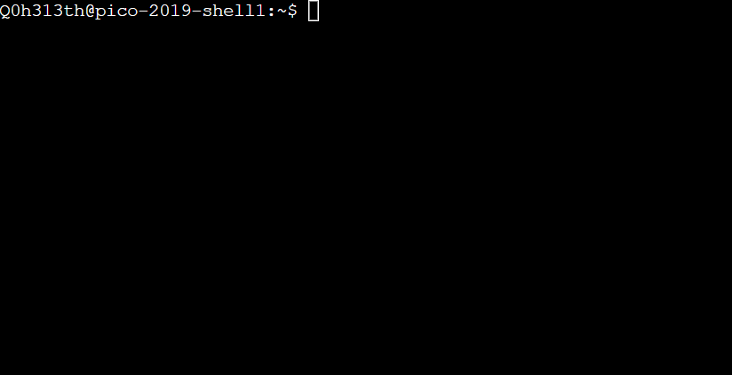

**Sumber** : [PicoPrimerCTF](https://primer.picoctf.org/)

---
## Shell

- **Apa itu shell ?**
Shell adalah sebuah program yang di gunakan untuk perantara antara pengguna dengan perangkat/sistem.

    

Dalam gambar tersebut ada apa saja ?
- **Q0h313th**
    > penggunan yang masuk ke dalam shell.
- **pico-2019-shell1**
    > Nama komputer yang sedang di pakai / host.
- **~**
    > di sebut dengan tilde, biasanya di gunakan untuk direktori home atau diperluas menjadi `/home/Q0h313th/`.

##### GUI-fu vs Shell-fu
|Operasi|Aksi GUI| Aksi Shell |Contoh Shell|Catatan|
|-------|--------|------------|------------|-------|
| Mulai aplikasi | Arahkan kursor dan klik | ketik nama aplikasi dan enter | &date | menekan tombol enter mengirimkan perintah ke shell untuk di jalankan |
| Buka Berkas | Telusuri file dan klik | gunakan perintah cat untuk membuka file | &cat | cat menampilkan semua teks dalam file |
| Unduh aplikasi | Jelajahi

##### Aspek yang menantang dalam menggunakan shell
1. Menghafal perintah 
2. Mengetik Perintah panjang 
3. Menghafal argumen untuk perintah

**Command untuk Linux**
> **cd**
untuk pindah ke halaman awal

> **pwd**
untuk melihat direktori/halaman yang sedang digunakan

>**ls**
daftar isi direktori

>**mkdir**
membuat direktori baru 

>**cat**
gabungkan file dan cetak file yang dituju

untuk mencari penjelasan command lainnya bisa buka [disini](https://explainshell.com/about)

## Forensik 

> wget : untuk mengunduh ataupun mengambil file yang belum di unduh hanya cukup dengan url
